# WordPress AI Delivery Flowchart

Use this reference when planning, executing, auditing, rescuing, or handing off a WordPress/CMS website project where AI performs substantial work under human supervision. Treat this as the control layer above the phase checklist: the checklist gives tasks; this flow defines order, decisions, loops, stop points, and evidence required before moving forward.

## Core Rule

Run WordPress delivery as a gated state machine. At every step, identify the current state, required inputs, AI actions allowed, human decision required, evidence required, and next branch. Do not advance because a checklist item was written; advance only when the gate condition is satisfied or an accountable human records an approved exception.

## Execution Algorithm

1. Identify the current flow state from the latest approved artifacts and evidence.
2. If an earlier required artifact is missing, stale, or contradicted, rewind to the earliest affected state.
3. Execute only from an AI task packet that names the current state, source artifacts, requirement IDs, allowed tools, prohibited actions, checks, evidence, reviewer, approver, and rollback or handoff notes.
4. At each decision node, choose exactly one branch: proceed, rework loop, approved exception, escalate, or stop.
5. Record every loop with reason, owner feedback, changes made, checks rerun, and approval status.
6. Keep PRD, page briefs, Conversion/SEO/Security Applicability Matrix entries, Design Artifact Strategies, Human Design Governance records, UX/UI Framework Compliance Matrices, AI design-tool prompt packages, anti-AI visual audits, Human Design Scorecards, content resilience/WordPress visual QA evidence, design artifacts, mockups, SRD/SRS, SEO requirements, cybersecurity controls, CPT model, code, tests, crawl evidence, launch notes, and operations documentation traceable by stable IDs.
7. Treat human-only decisions as blocking. AI may draft recommendations and evidence but cannot approve owner mockups, PRD/SRD baselines, SEO launch exceptions, cybersecurity launch exceptions, risk acceptance, production deployment, rollback, or final launch.

## Flowchart

```mermaid
flowchart TD
  A([Start: WordPress project request]) --> B[Classify project type, risk, and AI eligibility]
  B --> C{Sponsor, website owner, product, delivery, budget, scope, success metrics named?}
  C -- No --> C1[Collect missing governance inputs] --> C
  C -- Yes --> D{AI supervision, permissions, task packet, run log, and stop rules defined?}
  D -- No --> D1[Create AI delivery controls] --> D
  D -- Yes --> E[Discovery and current-state audit]
  E --> F{Discovery evidence sufficient for PRD?}
  F -- No --> E1[Interview, research, crawl, audit, and resolve gaps] --> F
  F -- Yes --> G[Draft PRD with requirements, scope, cybersecurity/SEO/content/analytics/support/ops needs]
  G --> H{PRD approved by accountable humans?}
  H -- No --> G1[Resolve comments, conflicts, scope, and risks] --> G
  H -- Approved exception/change --> G2[Record exception or change-control decision] --> I
  H -- Yes --> I[Create sitemap, page briefs, URL inventory, content model, and Conversion/SEO/Security Applicability Matrix]
  I --> J{Sitemap, page briefs, and applicability matrix complete for launch scope?}
  J -- No --> I1[Complete or defer pages and applicability items with approved exception] --> J
  J -- Yes --> K[Create SEO architecture and cybersecurity threat model/control plan from the applicability matrix]
  K --> L{SEO and cybersecurity architecture approved or exceptions recorded?}
  L -- No --> K1[Revise SEO/security plan, index rules, schema, canonicals, sitemap, redirects, forms, uploads, encryption, WAF/network, database, and performance budgets] --> K
  L -- Yes --> M0[Define Design Artifact Strategy, Human Design Governance record/design intent, UX/UI Framework Compliance Matrix, and AI design-tool prompt package from PRD, sitemap, page briefs, applicability matrix, content, SEO/security plans, brand, domain, WordPress CPT model, workflows, actions, components, states, anti-AI risks, content resilience, and WordPress visual completeness scope]
  M0 --> M0A{Design Artifact Strategy, Human Design Governance record, UX/UI Framework Compliance Matrix, and prompt package complete, reviewed, and approved for selected artifact execution?}
  M0A -- No --> M0B[Fill gaps, revise source artifacts, artifact strategy, Human Design Governance record, UX/UI Framework Compliance Matrix, or prompt, and record assumptions/exceptions] --> M0A
  M0A -- Yes --> M[Execute selected artifact path: Figma Make, Claude Design, JSON low/high fidelity specs, coded HTML/CSS mockups, prototypes, static screenshots, or hybrid design proof for all launch-scope pages/templates]
  M --> N{Website owner approves each mockup or equivalent design-baseline artifact?}
  N -- No --> M1[Rework selected design artifacts/mockups from owner feedback] --> N
  N -- Partial/deferred --> M2[Record page-level exception with sponsor/product-owner approval] --> O
  N -- Yes --> O{Accessibility, design, content, SEO, cybersecurity, and frontend/CMS feasibility pass?}
  O -- No --> M3[Revise design artifacts, mockups, prompts, or page briefs, then re-review] --> O
  O -- Yes --> O1{Anti-AI audit, Human Design Scorecard, content resilience, WordPress visual completeness, and rendered visual QA pass or exceptions approved?}
  O1 -- No --> M4[Revise design intent, patterns, content resilience, WordPress states, responsive behavior, or visual defects, then re-review] --> O1
  O1 -- Yes --> P[Freeze design baseline]
  P --> Q[Create or update SRD/SRS from approved PRD, Design Artifact Strategy, UX/UI Framework Compliance Matrix, mockups/design baseline, SEO plan, cybersecurity control plan, and WordPress constraints]
  Q --> R{SRD/SRS approved and aligned?}
  R -- No --> Q1[Resolve technical, requirement, data, integration, CPT, forms, web, network, database, encryption, secrets, security, privacy, accessibility, and operations gaps] --> Q
  R -- Yes --> S[Create AI task packets and release build backlog]
  S --> T{Each build task has source artifacts, allowed tools, checks, reviewer, and approver?}
  T -- No --> S1[Split, clarify, or block unsafe/unclear tasks] --> T
  T -- Yes --> U[Build secure WordPress foundation, theme/plugin structure, environments, and content workflow]
  U --> V{Project uses custom post types?}
  V -- Yes --> W[Implement CPTs with block builder disabled and custom metadata/metabox/media fields with nonce/capability/sanitize/escape controls]
  W --> X{CPT admin UI opens custom fields and media uploads with required security controls?}
  X -- No --> W1[Fix CPT registration, metaboxes, media fields, nonces, capability checks, validation, sanitization, escaping, save logic, and permissions] --> X
  X -- Yes --> Y[Build templates, forms, content, integrations, analytics, cybersecurity controls, accessibility, and SEO output]
  V -- No --> Y
  Y --> Z{Developer checks, secure-coding checks, and self-review pass?}
  Z -- No --> Y1[Fix code, content, config, security controls, tests, and documentation] --> Z
  Z -- Yes --> AA[Run QA, SAST/DAST/dependency/secret scans, accessibility, security, performance, analytics, and full-site SEO crawl]
  AA --> AB{Release checks pass?}
  AB -- No --> AA1[Remediate defects and rerun affected checks] --> AA
  AB -- SEO below 90 without exception --> AA2[Fix SEO findings or request approved exception] --> AA
  AB -- Security blocker without accepted risk --> AA3[Fix SQLi/authz/CSRF/secrets/encryption/upload/form/network/database findings or request approved risk acceptance] --> AA
  AB -- Yes --> AC[Run UAT with owner/product/content/support/operations]
  AC --> AD{UAT accepted?}
  AD -- No --> AD1[Triage UAT defects and route to build, content, design, PRD, or SRD change control] --> S
  AD -- Yes --> AE[Prepare launch plan, rollback, monitoring, support, security evidence package, SEO baseline, and AI evidence package]
  AE --> AF{Human go/no-go approves launch?}
  AF -- No-go --> AF1[Resolve blockers or reschedule launch] --> AE
  AF -- Go --> AG[Deploy with human-controlled production approval]
  AG --> AH{Production smoke, security headers/TLS/WAF/logs, SEO indexability, redirects, analytics, and monitoring stable?}
  AH -- Rollback needed --> AH1[Execute rollback and incident process] --> AE
  AH -- Hotfix needed --> AH2[Patch under emergency controls and verify] --> AH
  AH -- Stable --> AI[Hypercare monitoring, vulnerability/security-log review, and daily triage]
  AI --> AJ{Hypercare exit accepted?}
  AJ -- No --> AI1[Fix defects, support/content confusion, SEO/indexing issues, or operations gaps] --> AI
  AJ -- Yes --> AK[Operations handoff and continuous improvement]
  AK --> AL{New improvement, replatform, or sunset need?}
  AL -- Improvement --> G2
  AL -- Replatform/sunset --> AM[Run change-control, migration, SEO preservation, or decommission flow]
  AL -- No --> AN([Steady-state operations])
```

## State Checklist

| State | Entry condition | AI action | Decision/gate | Evidence before next state |
|---|---|---|---|---|
| F0 Intake/governance | Project request exists | Classify scope, risk, roles | Are sponsor, owner, budget, scope, success metrics, and AI controls named? | Charter, RACI, permission matrix, AI policy |
| F1 Discovery | Governance gate passes | Research, interview synthesis, current-site crawl/audit | Is evidence sufficient for PRD? | Discovery findings, requirements inventory, AI-safe context pack |
| F2 PRD baseline | Discovery accepted | Draft/revise PRD and traceability | Is PRD approved? | Approved PRD, requirement IDs, change-control record |
| F3 Sitemap/page briefs/applicability/SEO/security architecture | PRD approved | Draft sitemap, page briefs, Conversion/SEO/Security Applicability Matrix, SEO architecture, cybersecurity threat model/control plan | Are launch-scope URLs, content, conversion/trust/local items, SEO rules, security controls, and exceptions clear? | Sitemap, page briefs, applicability matrix, SEO plan, security control matrix, URL inventory |
| F4 Design artifact strategy, UX/UI framework compliance, prompt, and mockup loop | Page briefs, applicability matrix, SEO plan, and security control plan exist | Define Design Artifact Strategy, create Human Design Governance record/design intent, create UX/UI Framework Compliance Matrix, generate AI design-tool prompt package, execute selected artifact path, audit and revise page/template mockups or equivalent design artifacts | Are the strategy, Human Design Governance record, framework compliance matrix, prompt, anti-AI audit, scorecard, content resilience, WordPress visual completeness, visual QA, and owner approval complete for every launch-scope mockup/design baseline artifact? | Design Artifact Strategy, Human Design Governance record, UX/UI Framework Compliance Matrix, AI design-tool prompt package, selected artifacts, generated mockups or equivalent evidence, anti-AI visual audit, Human Design Scorecard, content resilience/WordPress visual QA evidence, output audit, feedback/rework log, frozen design baseline |
| F5 SRD/SRS baseline | Design baseline frozen | Translate PRD/mockups/SEO/security controls into technical requirements | Is SRD aligned and approved? | Approved SRD/SRS, architecture, CPT/data/integration/security specs |
| F6 AI task packets | SRD approved | Split work into executable packets | Are tasks safe, scoped, testable, and reviewable? | Task packets, run log entries, reviewer/approver assignments |
| F7 WordPress/CPT build | Task packets approved | Build theme/plugin/env/CMS/CPTs | Do CPT screens avoid block builder and use secure custom metadata/media UI? | Code/config diff, CPT admin UI security evidence, tests/screenshots |
| F8 Template/content/SEO implementation | Build foundation passes | Implement templates, forms, content workflow, metadata, schema, analytics, security controls | Do developer checks pass? | Self-review, secure-coding checks, automated checks, traceability updates |
| F9 QA and SEO crawl | Build checks pass | Run QA, security scans/manual tests, accessibility, performance, browser, crawl checks | Are security blockers closed and SEO target met or excepted? | QA report, cybersecurity evidence package, SEO crawl package, score/browser evidence, remediation log |
| F10 UAT | Release checks pass | Support UAT execution and defect triage | Does owner/product accept launch scope? | UAT signoff, deferred defects, accepted risks |
| F11 Launch readiness | UAT accepted | Prepare launch/rollback/monitoring/support evidence | Human go/no-go? | Launch checklist, security evidence, rollback test, approval record |
| F12 Deploy/stabilize | Go decision recorded | Assist deployment verification only within permissions | Stable, hotfix, or rollback? | Production smoke, security header/TLS/WAF/log evidence, SEO/indexability, analytics, monitoring evidence |
| F13 Hypercare/operations | Production stable | Monitor, triage, document, propose fixes | Exit hypercare? | Hypercare reports, security/vulnerability review, ops handoff, improvement backlog |

## Mandatory Rework Loops

- PRD loop: If owner/product/sponsor rejects scope, requirements, claims, KPIs, exclusions, or risks, revise the PRD and rerun approval before design baseline work proceeds.
- Applicability loop: If a compulsory default or triggered contextual conversion, SEO, analytics, privacy, local, trust, or security item is missing, unsupported, fake, unsafe, or unapproved, revise the matrix, page brief, design prompt, SRD, implementation, or exception before advancing.
- Design artifact strategy loop: If the project assumes low-fidelity wireframes are mandatory or skipped without rationale, or if the selected Figma Make, Claude Design, JSON, coded mockup, prototype, screenshot, or hybrid path cannot prove structure and review readiness, revise the strategy before design execution.
- UX/UI framework compliance loop: If any major workplace framework section, Human Design Governance row, anti-AI visual audit row, content resilience/WordPress visual QA row, scorecard expectation, UX law, or UX/UI dos/don'ts row is unclassified, unsupported by evidence, incorrectly marked not applicable, or exception-approved without accountable risk/mitigation/expiry, revise the matrix, strategy, prompt package, design artifact, or owner-review package before advancing.
- Human Design Governance loop: If design intent is missing, major visual decisions lack rationale, common patterns accumulate without justification, brand specificity is weak, swap-the-logo/restraint/component tests fail, content resilience breaks, secondary WordPress templates/states are visually weak, Human Design Scorecard is below threshold, hard failures exist, or rendered visual QA shows major defects, revise the design artifacts, prompt package, mockups, implementation, or exceptions before advancing.
- AI design prompt loop: If the prompt package misses the Design Artifact Strategy, UX/UI Framework Compliance Matrix, pages, workflows, actions, behaviors, states, widgets, menus, domain-specific features, WordPress/CPT/admin behavior, SEO/security/accessibility/privacy requirements, responsive rules, JSON/coded artifact instructions, or tool constraints, revise it before artifact execution.
- Mockup/design baseline loop: If the website owner rejects a page/template mockup or equivalent design-baseline artifact, rework that page/template through the selected artifact path and rerun owner review. Main WordPress/theme/template coding for that page/template stays blocked unless an exception is approved.
- SRD alignment loop: If SRD/SRS conflicts with PRD, mockups, SEO architecture, CPT model, privacy/security/accessibility requirements, or operations needs, revise SRD/SRS before build tickets are released.
- CPT loop: If a new project CPT opens the block builder by default, lacks required custom metadata/media fields, or fails save/render/permission checks, fix CPT implementation before QA/UAT.
- Security coding loop: If SQL injection, XSS, CSRF, broken authorization, exposed secrets, missing required encryption, unsafe uploads, form abuse, WAF/network, database, dependency, or logging findings appear, fix the control and rerun affected checks before QA/UAT/launch.
- SEO loop: If crawl or audit output is below the target, fix applicable metadata, schema, canonical, robots, sitemap, redirect, content, internal-link, image, or performance findings and rerun the crawl. Below-target launch requires an approved exception.
- QA loop: If automated/manual QA finds blockers, fix and rerun affected checks before UAT or launch readiness.
- UAT loop: If users reject flows, route changes to build/content/design or PRD/SRD change control, then rerun affected UAT.
- Launch loop: If go/no-go is no-go, fix blockers and rerun launch readiness. If production verification fails, hotfix or rollback under human control.
- Operations loop: If hypercare or steady-state monitoring finds recurring defects, SEO/indexing issues, support confusion, or improvement opportunities, route them through change control and a new release cycle.

## Flowchart Output Format

When using this skill to plan or execute a WordPress project, include this state summary in plans, handoffs, audits, and status updates:

- Current flow state:
- Completed gates:
- Blocked gates:
- Active loop, if any:
- Required human decision:
- AI actions allowed now:
- Evidence required before next state:
- Next branch after decision:
